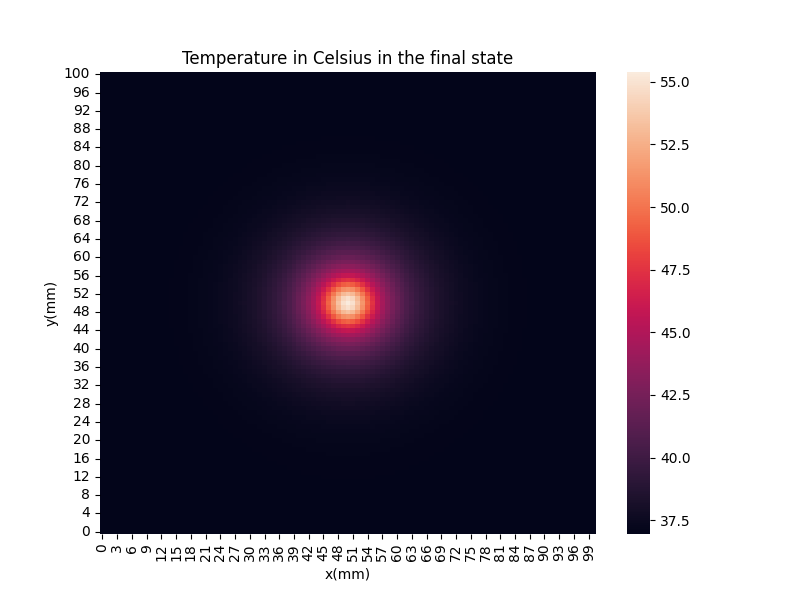

# TumorCellNecrosis

Project about tumor cell necrosis for Numerical Solution of Differential Equations course of the Department of Computer Science at UFJF. 
The reference article is "A Parallel 2D Numerical Simulation of Tumor Cells Necrosis by Local Hyperthermia", R F Reis et al 2014 J. Phys.: Conf. Ser. 490 012138. 

## Results

Simulation:


Final solution:



## Instructions (Linux)
Compile the c file, passing the -lm flag:
```
gcc main.c -o main -lm
```

Run the simulation, printing the solution every second: 
```
./main false
```

The *false* argument runs the simulation without advection. To run it with advection, pass the *true* argument.

A 16 min 40 s simulation of the temperature in the tumor region will be run, which takes around 3 min 20 s (Intel i7-1165G7 8GB). 

The solution will be printed on a single line for each time step, producing a 101 x 101 flattened matrix.

To save it to a file, you can redirect the output with the following command:
```
./main false > sol_tempo.txt
```

It is also possible to generate 3D graphs of the simulation and the heatmap of the final solution by running the script *plot_solution.py*:

```
python3 plot_solution.py sol_tempo.txt figs/
```

First argument: text file generated by the main program;
Second argument: directory to save the images to.
